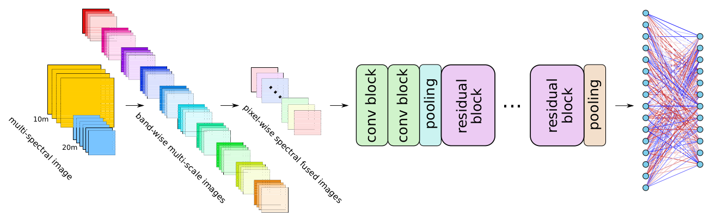

# Band-Wise Multi-Scale CNN Architecture for Remote Sensing Image Scene Classification

[Jian Kang](https://github.com/jiankang1991), [Begüm Demir](https://begumdemir.com/index.html)

---

This repo contains the codes for the IGARSS2020 paper: Band-Wise Multi-Scale CNN Architecture for Remote Sensing Image Scene Classification. we propose a novel CNN architecture for the feature embedding of high-dimensional RS images. The proposed architecture aims at: 1) decoupling the spectral and spatial feature extraction for sufficiently describing the complex information content of images; and 2) taking advantage of multi-scale representations of different land-use and land-cover classes present in the images. To this end, the proposed architecture is mainly composed of: 1) a convolutional layer for band-wise extraction of multi-scale spatial features; 2) a convolutional layer for pixel-wise extraction of spectral features; and 3) standard 2D convolution and residual blocks for further feature learning. Experiments on BigEarthNet validate the effectiveness of the proposed method, when compared to the state-of-the-art CNN architectures.


*An illustration of the architecture of the proposed BWMS. BWMS consists of three modules: 1) spatial feature extraction based on band-wise multi-scale convolution; 2) spectral feature extraction based on pixel-wise convolution; and 3) standard 2D convolutional and residual blocks for higher-level feature learning.*

<p align="center">

</p>
<p align=center>
Learning curves of all the CNN architectures.
</p>


<p align="center">

</p>


## Citation

```
@article{kang2020igarss,
  title={{Band-Wise Multi-Scale CNN Architecture for Remote Sensing Image Scene Classification}},
  author={Kang, Jian and Demir, Begüm},
  booktitle={IGARSS 2020-2020 IEEE International Geoscience and Remote Sensing Symposium},
  pages={},
  year={2020},
  organization={IEEE}
}